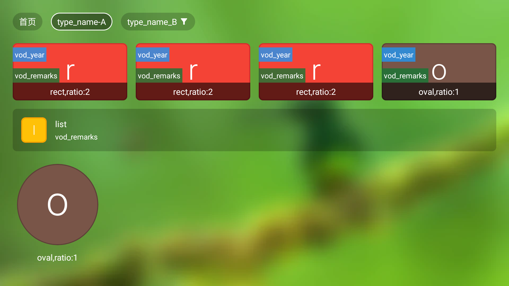
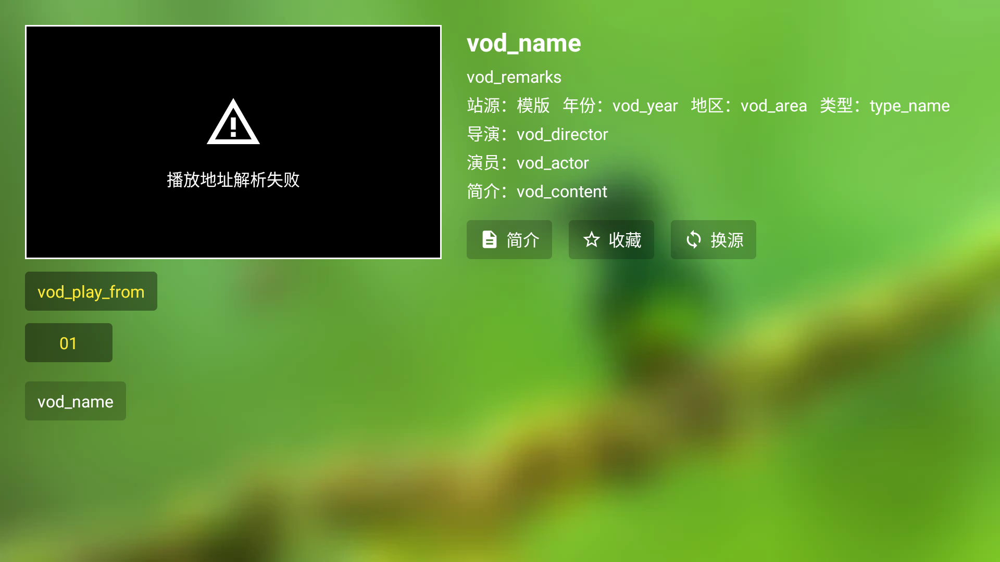
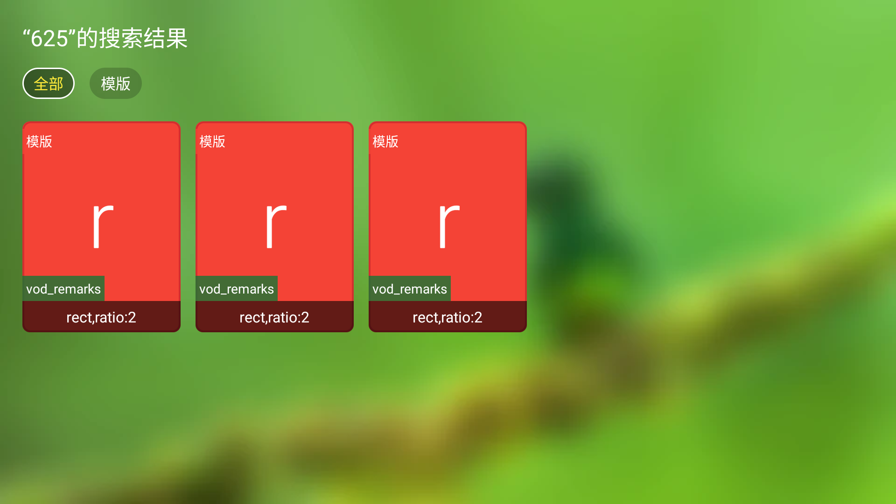

# CatVod 常用数据结构

## 爬虫需要实现主要方法参考
- 本文档主要参考的是 OK 影视 2.6.0 TV 版，其他应用或版本可能对字段定义，UI显示会有区别，请自行测试
- 文档中 `${}` 包裹的字段为非固定值，部分字段的实际意义不明确，欢迎补全
- 本文档提到的方法返回信息都是`JSON`编码的字符串，为了方便查看使用`JSON`编码前的结构做说明
- 大部分 `int` 类型字段实际上兼容 `string` 类型


### homeContent [主页及分类信息]

该方法用于获取首页的更新推荐和顶部的分类信息

```java
homeContent(boolean filter)
```
#### 调用参数

| 参数 | 类型     | 默认值           | 描述 |
| :-------- | :------- | :------------------------- | --------- |
| `filter` | `boolean` | true |  |

#### 返回信息

| 字段 | 类型     | 描述                | 备注 | UI是否有体现 |
| :-------- | :------- | :------------------------- | --------- | --------- |
| »`class` | `array[object]` | 分类 |  | 有 |
| »»`type_id` | `string` | 分类ID | 该`type_id`与`filters`下的`${type_id}`关联 | 无 |
| »»`type_name` | `string` | 分类名称 |  | 有 |
| »`filters` | `object` | 筛选器 |  | 有 |
| »»`${type_id}` | `array[object]` | 指定分类筛选器 | 该`type_id`与`class`下的`type_id`关联，不存在的项目没有分类筛选器 | 无 |
| »»»`key` | `string` | 分类筛选器key | 该值在分类筛选时会作为参数传递，同一个key下的选项只能选择一个 | 无 |
| »»»`name` | `string` | 分类筛选器名称 |  | 无 |
| »»»`value` | `array[object]` | 分类筛选器选项 |  | 无 |
| »»»»`n` | `string` | 分类筛选器选项名称 |  | 有 |
| »»»»`v` | `string` | 分类筛选器选项值 | 该值在分类筛选时会作为参数传递 | 无 |
| »`list` | `array[object]` | 首页更新推荐模块 |  | 有 |
| »»`vod_id` | `string` | 视频ID |  | 无 |
| »»`vod_name` | `string` | 视频名称 |  | 有 |
| »»`vod_pic` | `string` | 视频图片 | 当该字段为空或不存在时，会以`vod_name`首个字符作为图片展示 | 有 |
| »»`vod_remarks` | `string` | 视频备注 | | 有 |
| »»`vod_year` | `string` | 视频年份 | | 有 |
| | | | |  |

#### 完整示例

```json
{
    "class": [
        {
            "type_id": "type_id-A",
            "type_name": "type_name-A"
        },
        {
            "type_id": "type_id-B",
            "type_name": "type_name_B"
        }
    ],
    "filters": {
        "type_id-B": [
            {
                "key": "key-A",
                "name": "name-A",
                "value": [
                    {
                        "n": "n-AA",
                        "v": "v-AA"
                    },
                    {
                        "n": "n-AB",
                        "v": "v-AB"
                    }
                ]
            },
            {
                "key": "key-B",
                "name": "name-B",
                "value": [
                    {
                        "n": "n-BA",
                        "v": "v-BA"
                    },
                    {
                        "n": "n-BB",
                        "v": "v-BB"
                    }
                ]
            }
        ]
    },
    "list": [
        {
            "vod_id": "vod_id-A",
            "vod_name": "vod_name-A",
            "vod_pic": "vod_pic-A",
            "vod_remarks": "vod_remarks-A",
            "vod_year": "vod_year-A"
        },
        {
            "vod_id": "vod_id-B",
            "vod_name": "vod_name-B",
            "vod_pic": "vod_pic-B",
            "vod_remarks": "vod_remarks-B",
            "vod_year": "vod_year-B"
        }
    ]
}
```

#### 展示效果


### categoryContent [分类下的视频列表]

该方法用于获取首页的更新推荐和顶部的分类信息

```java
 categoryContent(String tid, String pg, boolean filter, HashMap<String, String> extend)
```
#### 调用参数

| 参数 | 类型     | 描述                       |
| :-------- | :------- | :-------------------------------- |
| `tid`     | `string` | **必选**. 分类Id,对应 `homeContent` 中的 `class`»`type_id` |
| `pg` | `int` | 页码，默认从1开始 |
| `filter` | `boolean` | 是否开启筛选，默认为`true` |
| `extend` | `object` | 筛选项参数，对应`homeContent`中的`class`»`filters`»`key `和 `class`»`filters`»`value`»`v` ，例如：{"key-A":"v-AA","key-B":"v-BB"}` |

#### 返回信息

| 字段            | 类型            | 描述                                                         | 备注                                                         | UI是否有体现 |
| :-------------- | :-------------- | :----------------------------------------------------------- | ------------------------------------------------------------ | ------------ |
| »`list`         | `array[object]` | 首页更新推荐模块                                             |                                                              | 有           |
| »»`vod_id`      | `string`        | 视频ID                                                       |                                                              | 无           |
| »»`vod_name`    | `string`        | 视频名称                                                     |                                                              | 有           |
| »»`vod_pic`     | `string`        | 视频图片                                                     | 当该字段为空或不存在时，会以`vod_name`首个字符作为图片展示   | 有           |
| »»`vod_remarks` | `string`        | 视频备注                                                     |                                                              | 有           |
| »»`vod_year`    | `string`        | 视频年份                                                     |                                                              | 有           |
| »»`vod_tag`     | `string`        | 可选值 `file`、`folder`、`manga`<br />默认值 `file`<br/>为 `file` 时 ，点击后会跳转至视频详情页<br/>为 `folder`时，点击后将 `vod_id` 做为 `tid` 参数请求分类下的视频列表页，并且可继承跳转前的分类的筛选项<br/>为`manga`时， |                                                              | 是           |
| »»`style`       | `object`        | 展示样式                                                     | 默认全局样式可在全局配置中设置，但是可以在列表返回中进行重新设置，每次返回结果中的第一个元素决定了本次返回的全局设置，但是 UI 层面只有在下一个新行的时候才会生效，具体可以参考示例图。不建议在一个分类下使用过多的样式，很容易出现预期之外的效果。 | 是           |
| »»»`type`       | `string`        | 样式类型 可选值 `rect`、`oval`、`list`                       |                                                              |              |
| »»»`ratio`      | `float`         | 宽高比                                                       |                                                              |              |
| »`pagecount`    | `int`           | 页码总数，用于判断是否还有下一页                             | 其他应用可能还会使用 `limit`、`total`等信息作为分页依据，不确认 | 无           |


#### 完整示例

```json
{
    "list": [
        {
            "vod_id": "vod_id-A",
            "vod_name": "vod_name-A",
            "vod_pic": "vod_pic-A",
            "vod_remarks": "vod_remarks-A",
            "vod_year": "vod_year-A",
            "style": {
                "type": "rect",
                "ratio": 1.5
            }
        },
        {
            "vod_id": "vod_id-B",
            "vod_name": "vod_name-B",
            "vod_pic": "vod_pic-B",
            "vod_remarks": "vod_remarks-B",
            "vod_year": "vod_year-B"
        }
    ],
    "pagecount":10
}
```

#### 展示效果



###  detailContent [视频详情页]

该方法用于获取首页的更新推荐和顶部的分类信息

```java
detailContent(List<String> ids)
```
#### 调用参数

| 参数 | 类型     | 默认值           | 描述 |
| :-------- | :------- | :------------------------- | --------- |
| `ids` | `string` | 无 | 视频ID,结构为数组,但实际使用中没发现入参为多个ID的场景 |

#### 返回信息

| 字段 | 类型     | 描述                | 备注 | UI是否有体现 |
| :-------- | :------- | :------------------------- | --------- | --------- |
| »`list` | `array[object]` | 首页更新推荐模块 |  | 有 |
| »»`vod_id` | `string` | 视频ID |  | 无 |
| »»`vod_name` | `string` | 视频名称 |  | 有 |
| »»`vod_pic` | `string` | 视频图片 |  | 无 |
| »»`vod_remarks` | `string` | 视频备注 | 支持特殊内链格式 | 有 |
| »»`vod_year` | `string` | 视频年份 | 支持特殊内链格式 但是无法通过遥控器选中 | 有 |
| »»`vod_area` | `string` | 视频地区 | 支持特殊内链格式 但是无法通过遥控器选中 | 有 |
| »»`type_name` | string | 视频类型 | 支持特殊内链格式 但是无法通过遥控器选中 | 有 |
| »»`vod_actor` | `string` | 视频演员 | 支持特殊内链格式 | 有 |
| »»`vod_director` | `string` | 视频导演 | 支持特殊内链格式 但是无法通过遥控器选中 | 有 |
| »»`vod_content` | `string` | 视频简介 | 支持特殊内链格式 但是无法通过遥控器选中 | 有 |
| »»`vod_play_from` | `string` | 播放TAB | | 有 |
| »»`vod_play_url` | `string` | 播放链接 | 多个可选分集通过 `#` 分隔，分集标题和链接通过 `$` 分隔 | 无 |
| »»`action` | `string` | 未知 | | 无 |

特殊内链格式

```
[a=cr:{"id":"tid分类ID","name":"分类名称"}/]分类名称[/a]
```


#### 完整示例

```json
{
    "list": [
        {
            "vod_id": "vod_id",
            "vod_name": "vod_name",
            "vod_pic": "vod_pic",
            "vod_remarks": "vod_remarks",
            "vod_year": "vod_year",
            "vod_area": "vod_area",
            "vod_actor": "vod_actor",
            "vod_director": "vod_director",
            "vod_content": "vod_content",
            "vod_play_from": "vod_play_from",
            "vod_play_url": "01$url1#02$url2",
            "type_name": "type_name",
            "action": "action"
        }
    ]
}
```

#### 展示效果



### playerContent [视频播放信息]

该方法用于获取视频的详细播放地址

```java
playerContent(String flag, String id, List<String> vipFlags)
```
#### 调用参数

| 参数 | 类型     | 默认值           | 描述 |
| :-------- | :------- | :------------------------- | --------- |
| `flag` | `string` | 无 | 与`detailContent`  » `vod_play_from` 关联 |
| `id` | `string` | 无 | 与`detailContent`  » `vod_play_url` 中的 `url` 关联 |
| `vipFlags` | `array` | 无 | 涉及各类 `vip` 账号 |

#### 返回信息

| 字段 | 类型     | 描述                | 备注 | UI是否有体现 |
| :-------- | :------- | :------------------------- | --------- | --------- |
| »`header` | `string` json | 播放链接`header` | 为JSON后的字符串 | 无 |
| »`url` | `string` | 播放链接`url` |  | 无 |

#### 完整示例

```json
{
    "header": "{\"User-Agent\":\"User-Agent\",\"Referer\":\"Referer\"}",
    "url": "url"
}
```


### searchContent [搜索]

该方法用于搜索视频

```java
searchContent(String key, boolean quick, String pg)
```
#### 调用参数

| 参数 | 类型     | 默认值           | 描述 |
| :-------- | :------- | :------------------------- | --------- |
| `key` | `string` | 无 | 搜索词 |
| `quick` | `boolean` |  |  |
| `pg` | `int` | 1 | 页码 |

#### 返回信息
| 字段            | 类型            | 描述                             | 备注                                                         | UI是否有体现 |
| :-------------- | :-------------- | :------------------------------- | ------------------------------------------------------------ | ------------ |
| »`list`         | `array[object]` | 首页更新推荐模块                 |                                                              | 有           |
| »»`vod_id`      | `string`        | 视频ID                           |                                                              | 无           |
| »»`vod_name`    | `string`        | 视频名称                         |                                                              | 有           |
| »»`vod_pic`     | `string`        | 视频图片                         | 当该字段为空或不存在时，会以`vod_name`首个字符作为图片展示   | 有           |
| »»`vod_remarks` | `string`        | 视频备注                         |                                                              | 有           |
| »»`vod_year`    | `string`        | 视频年份                         |                                                              | 有           |
| »`pagecount`    | `int`           | 页码总数，用于判断是否还有下一页 | 其他应用可能还会使用 `limit`、`total`等信息作为分页依据，不确认 | 无           |


#### 完整示例

```json
{
    "list": [
        {
            "vod_id": "vod_id-A",
            "vod_name": "vod_name-A",
            "vod_pic": "vod_pic-A",
            "vod_remarks": "vod_remarks-A",
            "vod_year": "vod_year-A"
        },
        {
            "vod_id": "vod_id-B",
            "vod_name": "vod_name-B",
            "vod_pic": "vod_pic-B",
            "vod_remarks": "vod_remarks-B",
            "vod_year": "vod_year-B"
        }
    ],
    "pagecount":10
}
```

#### 展示效果


